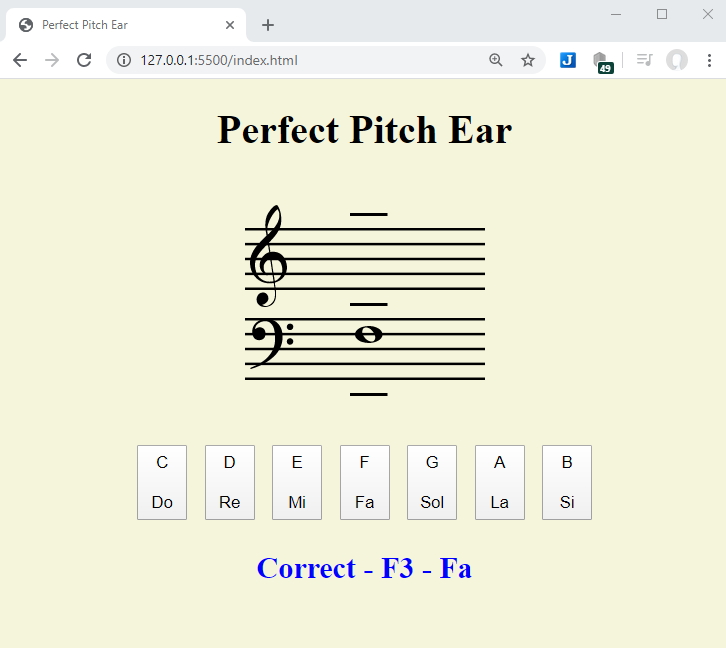

# Perfect Pitch Ear – Javascript WebApp

This webApp will help you to train your perfect pitch ear to identify the musical notes only by it's sound.

## Description
This is a simple webApp written in Javascript to run inside a browsers web page and it will help you train your perfect pitch ear. It plays a piano sound that you try to identify. When the answer is correct you will ear the piano sound again to reinforce your memory. The correct musical note also appears in the staff. With it you will learn almost all notes of the most used 4 octaves.
The principal technique used in this App is the fact that you can stack div’s tag’s containing image objects inside them. An outer boundary div is created and then inner div’s with absolute position inside them are stacked.
The images are all SVG’s (Scaled Vector Graphics)..   

## Screen shoot image 

## Music score SVG images
All the music score SVG images used on this webApp have a Creative Commons license and they were obtained from the following Wikipedia page.  
[Wikipedia Category:Musical score components](https://commons.wikimedia.org/wiki/Category:Musical_score_components)

## Lib used to generate the piano sound
I used the Keith William Horwood, Audiosynth - JS Dynamic Audio Synth lib.   
[Lib Audiosynth - JS Dynamic Audio Synth](https://keithwhor.github.io/audiosynth/)  
[Example of the lib usage - Musical Keyboard - JS Dynamic Audio Synth](https://keithwhor.com/music/)

## References
* [Wikipedia Category:Musical score components](https://commons.wikimedia.org/wiki/Category:Musical_score_components)
* [Lib Audiosynth - JS Dynamic Audio Synth](https://keithwhor.github.io/audiosynth/)
* [Example of the lib usage - Musical Keyboard - JS Dynamic Audio Synth](https://keithwhor.com/music/)

## License
MIT Open Source except the SVG images that have their own license and the Audiosynth - JS Dynamic Audio Synth lib that has it's own license. 

## Have fun!
Best regards,  
Joao Nuno Carvalho  

